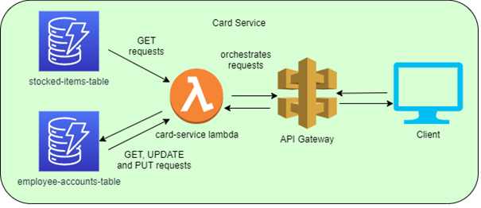

# Card Service  

Infrastructure:  


This API is provisioned in AWS, each file in this application is a AWS lambda.
It is orchestrated by API gateway and reads from one of two dynamoDB databases

This application is deployed into AWS,
each one of these files

* /account,  
* /goodbye,  
* /hello,  
* /login,  
* /signup  

Is a lambda and serves as an endpoint on my API,    
All of this is orchestrated by API gateway which manages my API methods    
the URL of this application is:  
<https://dol4161gx7.execute-api.eu-west-1.amazonaws.com/>  

If you want to run the unit tests you need to run:    

```text
npm i 
npm run test
```

User Documentation:   
Path = '/' Default    
Activity: User is starting the journey  
Method: GET  
URL: https://dol4161gx7.execute-api.eu-west-1.amazonaws.com/  

Path = '/login'
Activity: User taps card on reader and the API checks if the card is registered   
Method: GET   
URL: https://dol4161gx7.execute-api.eu-west-1.amazonaws.com/login  
QueryStringParameters (QSP):   
* cardId: fQsrf34FjseJ83Hf  

Path = '/account'  
Activity: User has typed in their pin and is directed to their account page; their account balance is displayed, and they are asked if they want to top up or purchase items    
Method: GET  
URL: https://dol4161gx7.execute-api.eu-west-1.amazonaws.com/login  
QSP:   
* cardId: fQsrf34FjseJ83Hf  
* pin: 1234  

Path = '/account/topup'  
Activity: User has inputted the amount they want to top up by.    
Method: POST    
URL: https://dol4161gx7.execute-api.eu-west-1.amazonaws.com/account/topup  
QSP:   
* cardId: fQsrf34FjseJ83Hf  
* pin: 1234  
Body:   
```
{
    "updateBalance": 10.00
}
```
  
Path = '/account/purchase'  
Activity: User wants to buy an item and they want to know what items there are to purchase and how much they are  
Method: GET  
URL: https://dol4161gx7.execute-api.eu-west-1.amazonaws.com/account/purchase  
QSP:   
* cardId: fQsrf34FjseJ83Hf  
* pin: 1234  

Path = '/signup'  
Activity: User is not signed up; they are prompted to enter in details to sign up  
Method: GET  
URL: https://dol4161gx7.execute-api.eu-west-1.amazonaws.com/signup  
QSP:   
 * cardId: aNewCardId  

Path = '/signup'    
Activity: User has entered in the details they want to sign up with   
Method: POST    
URL: https://dol4161gx7.execute-api.eu-west-1.amazonaws.com/signup    
QSP:   
 * cardId: aNewCardId    
Body:    
```
{
    "employeeId": "12345", 
    "mobileNo": "0787216458",
    "name": "BCS Examiner",
    "pin":"0000",
    "email": "bcs.exam@f1.com"
}
```    

Path = '/goodbye' users name known  
Activity: The user has timed out on their session or has tapped their card again to log out   
Method: GET  
URL: https://dol4161gx7.execute-api.eu-west-1.amazonaws.com/goodbye  
QSP:   
* name: Pikachu  


Path = '/goodbye' users name *not* known  
Activity: The user has logged out before the user’s name is found   
Method: GET  
URL: https://dol4161gx7.execute-api.eu-west-1.amazonaws.com/goodbye  

